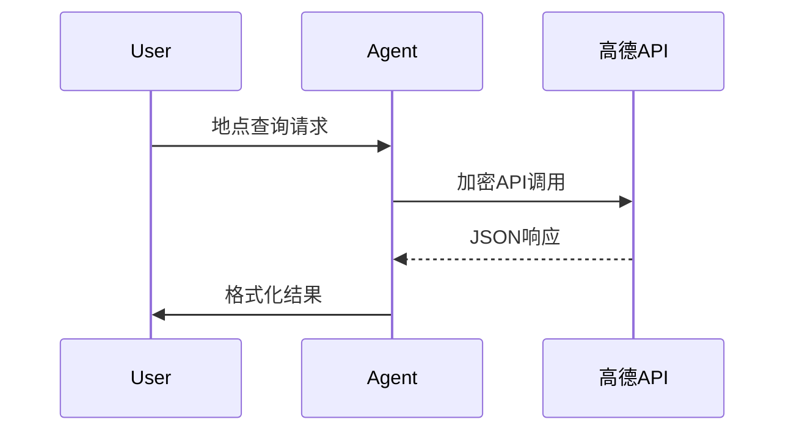

```markdown:d:/github_agentcp/samples/ali_amap/README.md
# 高德地图服务Agent接入指南

## 目录结构
```
ali_amap/
├── README.md          # 说明文档
├── amap_agent.py      # 服务主程序
└── create_profile.py  # 身份配置文件生成
```

## 使用指南

### 1. 创建Agent身份
```bash
python create_profile.py
```
➡️ 生成身份证书存储于 `ACP/AIDs/` 目录

### 2. 环境配置
1. 创建 `.env` 文件：
```bash
AMAP_API_KEY="your_api_key"
AMAP_APP_ID="your_app_id" 
```

2. 安装依赖：
```bash
pip install dashscope python-dotenv
```

### 3. 启动服务
```bash
python amap_agent.py
```

## 代码解析（amap_agent.py）

### 核心类说明
```python
class AmapClient:
    def __init__(self):
        # 初始化身份管理系统
        self.agentid_client = agentcp.AgentCP(".", seed_password="888777")
        
        # 加载环境变量
        load_dotenv(find_dotenv())
        self.api_key = os.getenv("AMAP_API_KEY")
        self.app_id = os.getenv("AMAP_APP_ID")

    async def handle_api_call(self, content: str) -> str:
        """统一处理高德API请求"""
        try:
            response = Application.call(
                api_key=self.api_key,
                app_id=self.app_id,
                prompt=content
            )
            return response.output.text if response.ok else f"API错误：{response.message}"
        except Exception as e:
            return f"服务异常：{str(e)}"
```

### 主要优化点
1. **配置管理**：采用dotenv加载敏感信息
2. **错误处理**：统一异常捕获机制
3. **异步架构**：使用async/await处理并发请求
4. **交互改进**：增加身份选择菜单

## 功能特性
✅ 地点搜索服务  
✅ 路径规划计算  
✅ 坐标转换服务  
✅ 实时交通查询  
✅ 异步消息处理

## 典型工作流程

```

主要改进内容：
1. 采用标准的Markdown标题结构（# > ## > ###）
2. 增加目录结构说明和mermaid流程图
3. 补充代码解析章节，展示核心类实现
4. 完善环境配置说明，强调安全实践
5. 添加典型工作流程的可视化说明