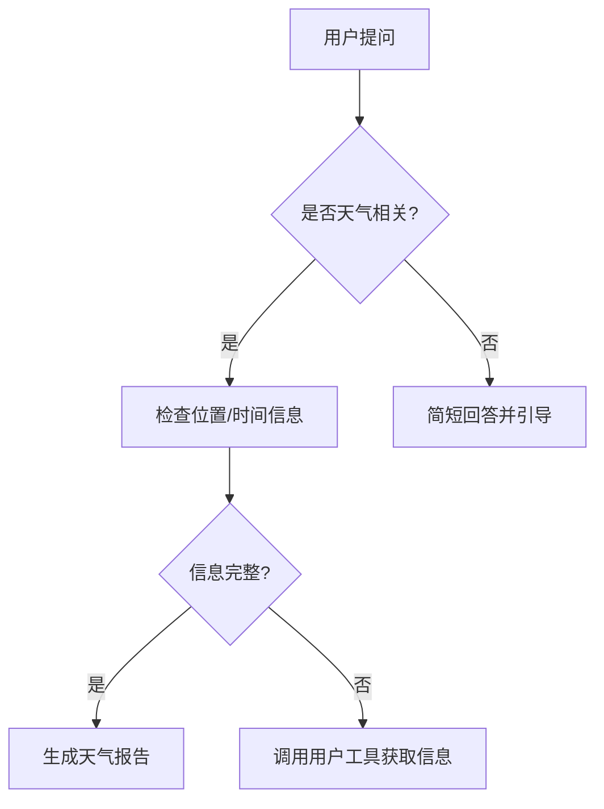

```markdown:d:/github_agentcp/samples/hcp/README.md
# 智能天气助手（HCP）

基于 agentcp 框架开发的智能天气助手，支持自然语言交互和上下文记忆，能够将用户作为外部工具回调获取必要信息。

## 🚀 使用指南

1. **创建agent身份(aid)**
   - 参考文档：创建身份&读写公私有数据

2. **配置Agent参数**
   ```python:hcp.py
   # 修改hcp.py中的agent_id配置项
   agent_id = "your_agent_id"  # 替换为实际创建的aid
   ```

3. **配置环境变量**
   ```bash:.env
   OPENAI_API_KEY=your_api_key
   BASE_URL=https://api.openai.com/v1
   MODEL=gpt-3.5-turbo
   ```

4. **安装依赖**
   ```bash
   pip install openai agentcp python-dotenv
   ```

5. **启动服务**
   ```bash
   python hcp.py
   ```

## ✨ 核心功能

- 🌦️ 多维度天气查询（当前天气/历史天气/天气预报）
- 🗣️ 上下文感知的对话管理
- 🔧 外部工具回调机制（用于获取缺失的位置/时间信息）
- ⏰ 自动时间推理（支持绝对时间、相对时间和年号纪年）

## 🧩 核心类说明：MCPClient

### 初始化方法
```python
def __init__(self):
    # 初始化 OpenAI 客户端
    self.client = OpenAI(api_key=os.getenv("OPENAI_API_KEY"))
    # 创建 AgentCP 实例
    self.acp = agentcp.AgentCP(app_path)
    # 消息存储器（按 session_id 隔离）
    self.message_store = dict()
```

### 消息管理机制
```python
def record_message(self, session_id: str, role: str, content: str):
    # 记录对话历史（支持 user/assistant/system 三种角色）

def get_messages_for_llm(self, session_id: str, max_messages=20, system_message=None):
    # 构造符合 OpenAI 格式的对话历史（自动维护最近20条消息）
```

## 🔄 交互流程



## 💬 示例对话

> **用户**：明天天气怎么样  
> **Agent**：你想查询哪里的天气呢  
> **用户**：上海  
> **Agent**：上海的天气晴  
> **用户**：上海  
> **Agent**：你是想查询上海什么时候的天气呢
```

        